<!-- Name + Character side by side -->
<table align="center" border="0" cellpadding="10" cellspacing="0">
<tr>
<td valign="middle">
  
</td>
<td valign="middle">
  <h1 style="margin:0">Venkatachalam S</h1>
  
<b>Full Stack Engineer &nbsp;|&nbsp; AI &nbsp;|&nbsp; Cloud</b>

</td>
</tr>
</table>

 
<table><tr>
  <td align="center"><a href="https://linkedin.com/in/venkatachalam-subramanian/"> <b>LinkedIn</b></a></td>
  <td align="center"><a href="https://github.com/Venkat7123"> <b>GitHub</b></a></td>
  <td align="center"><a href="mailto:venkatachalamsubramanian23@gmail.com"> <b>Gmail</b></a></td>
  <td align="center"><a href="https://leetcode.com/Venkat7123"> <b>LeetCode</b></a></td>
</tr></table>

---

## 🧑‍💻 About Me

```mermaid
%%{init: {'theme': 'dark', 'themeVariables': { 'fontSize': '20px'}}}%%
flowchart TD
    A(["🧑‍💻 Venkatachalam S\nIT Undergrad · Full Stack Engineer\nGoogle Student Ambassador 🌟\nOracle Java SE 21 Certified ☕"])

    A --> B(["⚙️ Core Technologies"])
    B --> B1(["💻 Languages\nJava · Python · JS · TS · C"])
    B --> B2(["🎨 Frontend\nReact · Next.js · Tailwind"])
    B --> B3(["⚙️ Backend\nSpring Boot · Node.js · Express"])
    B --> B4(["☁️ Databases & Cloud\nMongoDB · Firebase · AWS"])

    A --> C(["🌐 Domains of Experience"])
    C --> C1(["🤖 Generative AI & ML\nOpenAI · Gemini · Scikit-Learn"])
    C --> C2(["🔗 Real-Time Systems\nSocket.io · REST APIs · WebSockets"])
    C --> C3(["☁️ Cloud Computing\nAWS · Azure · GCP"])
    C --> C4(["🔐 Web3 & Blockchain\nZero-Knowledge Proofs · Cardano"])

    A --> D(["🔥 Areas of Passion"])
    D --> D1(["Full-Stack Software Engineering"])
    D --> D2(["AI & Agentic Systems"])
    D --> D3(["Backend Engineering"])
    D --> D4(["Cloud & Distributed Systems"])
    D --> D5(["Scalable System Design"])

    style A fill:#0d1117,stroke:#00d9ff,stroke-width:3px,color:#00d9ff
    style B fill:#0d1117,stroke:#58a6ff,stroke-width:2px,color:#58a6ff
    style B1 fill:#161b22,stroke:#58a6ff,color:#cdd9e5
    style B2 fill:#161b22,stroke:#58a6ff,color:#cdd9e5
    style B3 fill:#161b22,stroke:#58a6ff,color:#cdd9e5
    style B4 fill:#161b22,stroke:#58a6ff,color:#cdd9e5
    style C fill:#0d1117,stroke:#bc8cff,stroke-width:2px,color:#bc8cff
    style C1 fill:#161b22,stroke:#bc8cff,color:#cdd9e5
    style C2 fill:#161b22,stroke:#bc8cff,color:#cdd9e5
    style C3 fill:#161b22,stroke:#bc8cff,color:#cdd9e5
    style C4 fill:#161b22,stroke:#bc8cff,color:#cdd9e5
    style D fill:#0d1117,stroke:#e3b341,stroke-width:2px,color:#e3b341
    style D1 fill:#161b22,stroke:#e3b341,color:#cdd9e5
    style D2 fill:#161b22,stroke:#e3b341,color:#cdd9e5
    style D3 fill:#161b22,stroke:#e3b341,color:#cdd9e5
    style D4 fill:#161b22,stroke:#e3b341,color:#cdd9e5
    style D5 fill:#161b22,stroke:#e3b341,color:#cdd9e5
```

---

## 🛠️ Tech Stack

### 💻 Languages

<table><tr>
  <td align="center"> <b>Java</b></td>
  <td align="center"> <b>Python</b></td>
  <td align="center"> <b>JavaScript</b></td>
  <td align="center"> <b>TypeScript</b></td>
  <td align="center"> <b>C</b></td>
  <td align="center"> <b>SQL</b></td>
</tr></table>

### 🎨 Frontend

<table><tr>
  <td align="center"> <b>React</b></td>
  <td align="center"> <b>Next.js</b></td>
  <td align="center"> <b>Tailwind CSS</b></td>
  <td align="center"> <b>HTML5</b></td>
  <td align="center"> <b>CSS3</b></td>
</tr></table>

### ⚙️ Backend

<table><tr>
  <td align="center"> <b>Spring Boot</b></td>
  <td align="center"> <b>Node.js</b></td>
  <td align="center"> <b>Express.js</b></td>
  <td align="center"> <b>Socket.io</b></td>
  <td align="center"> <b>Postman</b></td>
</tr></table>

### 🗄️ Databases

<table><tr>
  <td align="center"> <b>MongoDB</b></td>
  <td align="center"> <b>MySQL</b></td>
  <td align="center"> <b>Firebase</b></td>
  <td align="center"> <b>Supabase</b></td>
  <td align="center"> <b>Redis</b></td>
</tr></table>

### ☁️ Cloud & DevOps

<table><tr>
  <td align="center"> <b>AWS</b></td>
  <td align="center"> <b>Azure</b></td>
  <td align="center"> <b>GCP</b></td>
  <td align="center"> <b>Vercel</b></td>
  <td align="center"> <b>GitHub Actions</b></td>
  <td align="center"> <b>Docker</b></td>
</tr></table>

### 🤖 AI & ML

<table><tr>
  <td align="center"> <b>OpenAI</b></td>
  <td align="center"> <b>Gemini AI</b></td>
  <td align="center"> <b>Scikit-Learn</b></td>
  <td align="center"> <b>PyTorch</b></td>
  <td align="center"> <b>TensorFlow</b></td>
</tr></table>

---

## 📊 GitHub Stats

 

---

## 📈 Contribution Graph

  

---

## 🚀 Featured Projects

### 🎵 [eCLIPSe](https://github.com/Venkat7123/eCLIPSe-A_Music_Clip_Streaming_Platform) — Full-Stack Music Streaming & Audio Clipping Platform
> `React` `Node.js` `Express` `MongoDB` `Redis` `Socket.io` `Wavesurfer.js` `Firebase` `Cloudinary`

- Built scalable music streaming app with **real-time playback sync** and dynamic playlist management
- Designed **offline-first architecture** with IndexedDB audio caching + Redis server-side caching
- Developed **waveform-based audio clipping** and drag-and-drop playlist features

---

### 🏥 [VitalSync](https://github.com/Venkat7123) — AI-Powered Smart Health Monitoring Platform
> `React` `Spring Boot` `Gemini AI` `Supabase` `REST API`

- Voice-navigated AI health assistant for **hands-free** health metric tracking & medication management
- **Multilingual NLP** support across 3 regional languages + AI report summarization
- Real-time health dashboard with alert thresholds, live data updates under **300ms latency**

---

### 🆘 [Seva](https://github.com/Pranav-mb-dev/VitalSync-Codecrew) — AI-Powered Triage Engine for Community Crisis
> `React.js` `Node.js` `Express.js` `Firebase` `Gemini AI`

- AI crisis response platform automating **volunteer-task allocation** based on skills, location & urgency
- Built real-time organizer & volunteer portals with Firebase Firestore + REST APIs
- Implemented **OCR-based document processing**, geospatial resource tracking & analytics modules

---

## 🐍 Contribution Snake

  <picture>
    <source media="(prefers-color-scheme: dark)" srcset="https://raw.githubusercontent.com/Venkat7123/Venkat7123/output/github-contribution-grid-snake-dark.svg" />
    <source media="(prefers-color-scheme: light)" srcset="https://raw.githubusercontent.com/Venkat7123/Venkat7123/output/github-contribution-grid-snake.svg" />
    
  </picture>

---

